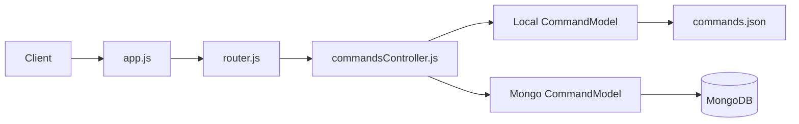

# Commander Architecture

Commander Backend is an Express API that maps slash-style commands such as `/hello` to predefined text responses.

## System Diagram



## Runtime Modes

| Mode    | Entry Point           | Storage                    |
| ------- | --------------------- | -------------------------- |
| Local   | `src/local-server.js` | `src/config/commands.json` |
| MongoDB | `src/mongo-db.js`     | MongoDB via Mongoose       |

## Project Structure

```text
.
├── ARCHITECTURE.md
├── README.md
├── backend/
│   ├── api.http
│   ├── package.json
│   └── src/
│       ├── app.js
│       ├── local-server.js
│       ├── mongo-db.js
│       ├── config/
│       │   ├── commands.json
│       │   ├── config.js
│       │   └── swagger.js
│       ├── controllers/
│       │   └── commandsController.js
│       ├── models/
│       │   ├── local-system/
│       │   │   └── commandModel.js
│       │   └── mongo/
│       │       └── commandModel.js
│       ├── router/
│       │   └── router.js
│       ├── schemas/
│       │   └── mongo-schema/
│       │       └── commandSchema.js
│       ├── utils/
│       │   └── errors.js
│       └── web/
│           ├── index.html
│           ├── index.js
│           └── style/
│               └── style.css
```

## Key Paths

| Path                               | Role                                                     |
| ---------------------------------- | -------------------------------------------------------- |
| `README.md`                        | Short project entry point                                |
| `ARCHITECTURE.md`                  | Detailed technical reference                             |
| `backend/api.http`                 | Manual API request examples                              |
| `backend/src/app.js`               | App factory, middleware, Swagger, routes, error handling |
| `backend/src/local-server.js`      | Starts local JSON-backed mode                            |
| `backend/src/mongo-db.js`          | Starts MongoDB-backed mode                               |
| `backend/src/config/`              | Environment config, local data, Swagger setup            |
| `backend/src/controllers/`         | HTTP controller logic                                    |
| `backend/src/models/local-system/` | Local command model                                      |
| `backend/src/models/mongo/`        | MongoDB command model                                    |
| `backend/src/router/`              | Route definitions and OpenAPI annotations                |
| `backend/src/schemas/`             | Mongoose schema definitions                              |
| `backend/src/utils/`               | Shared error classes and middleware                      |
| `backend/src/web/`                 | Frontend prototype for command lookup                    |

## API Summary

Base paths:

- `/api/commands`
- `/api-docs`

| Method   | Route                            | Purpose                      |
| -------- | -------------------------------- | ---------------------------- |
| `GET`    | `/api/commands`                  | List commands                |
| `GET`    | `/api/commands?trigger=%2Fhello` | Resolve a command by trigger |
| `GET`    | `/api/commands/:id`              | Get a command by ID          |
| `POST`   | `/api/commands`                  | Create a command             |
| `PATCH`  | `/api/commands/:id`              | Update a command             |
| `DELETE` | `/api/commands/:id`              | Delete a command             |

Payload shape:

```json
{
  "name": "Greeting",
  "command": "/hello",
  "text": "Hello there!"
}
```

## Configuration

| Variable       | Required          | Notes                            |
| -------------- | ----------------- | -------------------------------- |
| `PORT`         | Yes               | Used by both server entry points |
| `DATABASE_URL` | MongoDB mode only | Used by the MongoDB model        |

```env
PORT=1234
DATABASE_URL=mongodb://127.0.0.1:27017/commander
```

## Notes

- Local mode returns command data from JSON
- MongoDB mode returns paginated list data for `GET /api/commands`
- `src/web` exists as a prototype and is not currently served by Express
