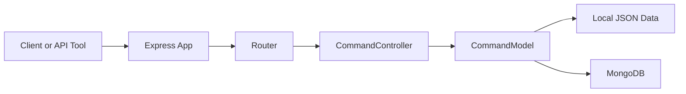

# Commander Architecture

## Overview

Commander Backend is an Express-based API that stores and resolves slash-style commands such as `/hello` into predefined text responses.

The application is built around a small, replaceable data-access layer:

- `local-server.js` runs the API with a local JSON-backed model
- `mongo-db.js` runs the API with a MongoDB-backed Mongoose model

This keeps the HTTP layer the same while allowing different persistence strategies.

## High-Level Flow



Request flow in code:

1. `src/app.js` creates the Express app and registers middleware
2. `src/router/router.js` maps HTTP routes to controller methods
3. `src/controllers/commandsController.js` handles request-level behavior
4. A command model implementation performs the actual data operation
5. `src/utils/errors.js` converts thrown errors into consistent HTTP responses

## Runtime Modes

| Mode | Entry Point | Storage | Purpose |
| --- | --- | --- | --- |
| Local | `src/local-server.js` | `src/config/commands.json` | Fast development without a database |
| MongoDB | `src/mongo-db.js` | MongoDB via Mongoose | Persistent storage |

Both entry points create the app through the same factory in `src/app.js`.

## Project Structure

```text
.
├── ARCHITECTURE.md
├── backend/
│   ├── api.http
│   ├── package.json
│   └── src/
│       ├── app.js
│       ├── local-server.js
│       ├── mongo-db.js
│       ├── config/
│       │   ├── commands.json
│       │   ├── config.js
│       │   └── swagger.js
│       ├── controllers/
│       │   └── commandsController.js
│       ├── models/
│       │   ├── local-system/
│       │   │   └── commandModel.js
│       │   └── mongo/
│       │       └── commandModel.js
│       ├── router/
│       │   └── router.js
│       ├── schemas/
│       │   └── mongo-schema/
│       │       └── commandSchema.js
│       ├── utils/
│       │   └── errors.js
│       └── web/
│           ├── index.html
│           ├── index.js
│           └── style/
│               └── style.css
└── readme.md
```

## Folder and File Responsibilities

### Root

- `readme.md`: short project overview, setup, and entry-point documentation
- `ARCHITECTURE.md`: detailed technical reference for structure and API

### `backend/`

- `package.json`: dependencies, scripts, package metadata
- `api.http`: sample HTTP requests for manual testing in VS Code REST Client or similar tools

### `backend/src/`

- `app.js`: builds the Express app, applies middleware, mounts Swagger, registers routes, and installs the global error handler
- `local-server.js`: starts the app using the local JSON-backed model
- `mongo-db.js`: starts the app using the MongoDB-backed model

### `backend/src/config/`

- `commands.json`: seed-like local command data used by local mode
- `config.js`: exposes environment variables such as `PORT` and `DATABASE_URL`
- `swagger.js`: OpenAPI definition bootstrap for Swagger UI

### `backend/src/controllers/`

- `commandsController.js`: request handlers for listing, lookup, create, update, and delete operations

### `backend/src/models/`

- `local-system/commandModel.js`: in-memory/local JSON implementation
- `mongo/commandModel.js`: Mongoose-based persistence implementation

### `backend/src/router/`

- `router.js`: route definitions plus OpenAPI JSDoc annotations

### `backend/src/schemas/`

- `mongo-schema/commandSchema.js`: Mongoose schema describing a command document

### `backend/src/utils/`

- `errors.js`: shared error classes and Express error middleware

### `backend/src/web/`

- `index.html`, `index.js`, `style/style.css`: small frontend prototype for entering a command and displaying a response

Note: the current backend code does not appear to serve `src/web` as static assets.

## API Structure

### Base Paths

- API base: `/api/commands`
- Swagger UI: `/api-docs`

### Endpoints

| Method | Route | Purpose |
| --- | --- | --- |
| `GET` | `/api/commands` | List commands |
| `GET` | `/api/commands?trigger=%2Fhello` | Resolve a command by trigger |
| `GET` | `/api/commands/:id` | Get a command by ID |
| `POST` | `/api/commands` | Create a command |
| `PATCH` | `/api/commands/:id` | Update a command |
| `DELETE` | `/api/commands/:id` | Delete a command |

### Request and Response Notes

- `GET /api/commands?trigger=...` URL-decodes the trigger before lookup
- In MongoDB mode, `GET /api/commands` returns a paginated object with `commands` and `totalPages`
- In local mode, `GET /api/commands` currently returns the full command array directly
- `POST /api/commands` expects `name`, `command`, and `text`
- `PATCH /api/commands/:id` rejects an empty body

### Example Payload

```json
{
  "name": "Greeting",
  "command": "/hello",
  "text": "Hello there!"
}
```

## Data Model

Command fields:

- `name`: display name for the command
- `command`: trigger string, usually starting with `/`
- `text`: response text returned to the client

Current identifier shape differs by storage mode:

- Local mode uses `id` values from JSON data
- MongoDB mode uses MongoDB document identifiers such as `_id`

## Environment and Configuration

| Variable | Required | Used By |
| --- | --- | --- |
| `PORT` | Yes | Both server entry points |
| `DATABASE_URL` | MongoDB mode only | `src/models/mongo/commandModel.js` |

Example:

```env
PORT=1234
DATABASE_URL=mongodb://127.0.0.1:27017/commander
```

## Manual Testing

- Use `backend/api.http` for ready-made requests
- Use `/api-docs` for Swagger-based interactive documentation
- Use `src/web` if you want a simple client prototype to build on

## Current Design Observations

- The shared app factory is a good separation point between transport and storage
- Local mode and MongoDB mode do not currently return the same shape for list requests
- The frontend prototype exists in the repository but is not integrated into the Express app yet
- There is no test suite configured yet