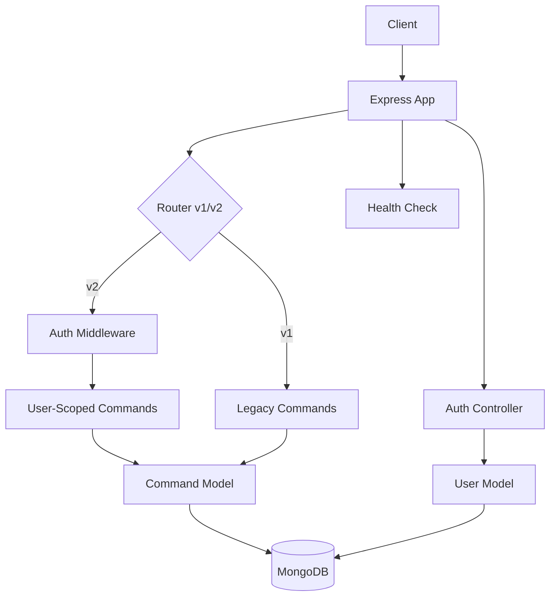

# Commander Architecture

Commander Backend is a modular Express API that maps slash-style commands such as `/hello` to predefined text responses.

Starting with v2, the system introduces **User Authentication** and **Data Ownership**, allowing multiple users to manage their own private command snippets.

## System Diagram



## Runtime Modes

The application primarily runs in **MongoDB mode** for production and v2 features.

| Mode    | Entry Point            | Storage                    | Notes                                        |
| ------- | ---------------------- | -------------------------- | -------------------------------------------- |
| MongoDB | `src/mongo-db.js`      | MongoDB via Mongoose       | Supports v1, v2, and User Authentication.    |
| Local\* | `src/app.js` (factory) | `src/config/commands.json` | \*Legacy support via CommandModel injection. |

## Project Structure

```text
.
├── ARCHITECTURE.md
├── README.md
├── backend/
│   ├── api.http
│   ├── package.json
│   └── src/
│       ├── app.js              # App factory & shared middleware
│       ├── mongo-db.js         # MongoDB-backed server entry point
│       ├── config/
│       │   ├── config.js       # Environment configuration & SMTP validation
│       │   ├── constants.js    # System-wide constants (BCrypt, tokens)
│       │   └── swagger.js      # OpenAPI/Swagger configuration
│       ├── controllers/
│       │   ├── authController.js     # User registration, login, forgot password
│       │   ├── commandsController.js # CRUD for commands
│       │   └── healthController.js   # Service health check
│       ├── middleware/
│       │   ├── authMiddleware.js     # JWT verification
│       │   ├── authValidation.js     # Input validation for auth routes
│       │   ├── loggerMiddleware.js   # Request logging
│       │   └── triggerMiddleware.js  # Legacy trigger resolution
│       ├── models/
│       │   ├── local-system/
│       │   │   └── commandModel.js   # JSON-backed command model
│       │   └── mongo/
│       │       ├── commandModel.js   # Mongoose-backed command model
│       │       └── userModel.js      # Mongoose-backed user model
│       ├── router/
│       │   └── router.js             # Version-aware route definitions
│       ├── schemas/
│       │   └── mongo-schema/
│       │       ├── commandSchema.js  # Mongoose schema for commands
│       │       └── userSchema.js     # Mongoose schema for users
│       ├── utils/
│       │   ├── auth.js               # JWT and Password utilities
│       │   ├── email.js              # Nodemailer/SMTP transport
│       │   └── errors.js             # Custom Error classes & handler
│       └── web/
│           ├── index.html            # Prototype frontend
│           ├── index.js
│           └── style/
│               └── style.css
```

## Key Paths

| Path                           | Role                                                         |
| ------------------------------ | ------------------------------------------------------------ |
| `backend/src/app.js`           | Main Express factory. Configures CORS, logging, and routing. |
| `backend/src/router/router.js` | Mounts v1 (public) and v2 (authenticated) API paths.         |
| `backend/src/utils/email.js`   | Manages SMTP transporter for password reset emails.          |
| `backend/src/utils/auth.js`    | Core logic for JWT signing and password hashing.             |

## API Summary

The API is versioned. v1 is maintained for backward compatibility, while v2 requires authentication.

### Health Check

- `GET /api/health` - Check service status.

### Authentication (v2)

| Method | Route                                | Purpose                                  |
| ------ | ------------------------------------ | ---------------------------------------- |
| `POST` | `/api/v2/auth/register`              | Register a new user account.             |
| `POST` | `/api/v2/auth/login`                 | Authenticate and receive JWT.            |
| `POST` | `/api/v2/auth/forgot-password`       | Request a password reset link via email. |
| `POST` | `/api/v2/auth/reset-password/:token` | Reset password using a valid token (URL param). |
| `POST` | `/api/v2/auth/password-resets`       | Reset password using a token in the request body. |

### Commands

| Method   | v1 Route (Public)   | v2 Route (Auth Required) | Purpose              |
| -------- | ------------------- | ------------------------ | -------------------- |
| `GET`    | `/api/commands`     | `/api/v2/commands`       | List owned commands. |
| `GET`    | `/api/commands/:id` | `/api/v2/commands/:id`   | Get command by ID.   |
| `POST`   | `/api/commands`     | `/api/v2/commands`       | Create a command.    |
| `PATCH`  | `/api/commands/:id` | `/api/v2/commands/:id`   | Update a command.    |
| `DELETE` | `/api/commands/:id` | `/api/v2/commands/:id`   | Delete a command.    |

## Configuration

The application is configured via environment variables:

| Variable       | Description                                     | Default |
| -------------- | ----------------------------------------------- | ------- |
| `PORT`         | Port number for the Express server.             | 1234    |
| `DATABASE_URL` | MongoDB connection string.                      | -       |
| `API_VERSION`  | `v1`, `v2`, or `both`. Controls route mounting. | `both`  |
| `JWT_SECRET`   | Secret key for signing JSON Web Tokens.         | -       |
| `SMTP_HOST`    | SMTP server for sending reset emails.           | -       |
| `SMTP_PORT`    | SMTP port (e.g., 587 or 465).                   | -       |
| `SMTP_USER`    | SMTP authentication username.                   | -       |
| `SMTP_PASS`    | SMTP authentication password.                   | -       |
| `FRONTEND_URL` | Base URL for password reset links.              | -       |

## Security Notes

- **Password Hashing**: Done via `bcrypt` with `SALT_ROUNDS=10`.
- **JWT**: Tokens include `userId` and are used for all `v2` requests.
- **Ownership**: Every command in v2 is linked to a `userId`. The system prevents users from accessing or modifying commands they do not own.
- **Email Security**: SMTP configuration is validated at startup to ensure the "Forgot Password" service is reliable.
