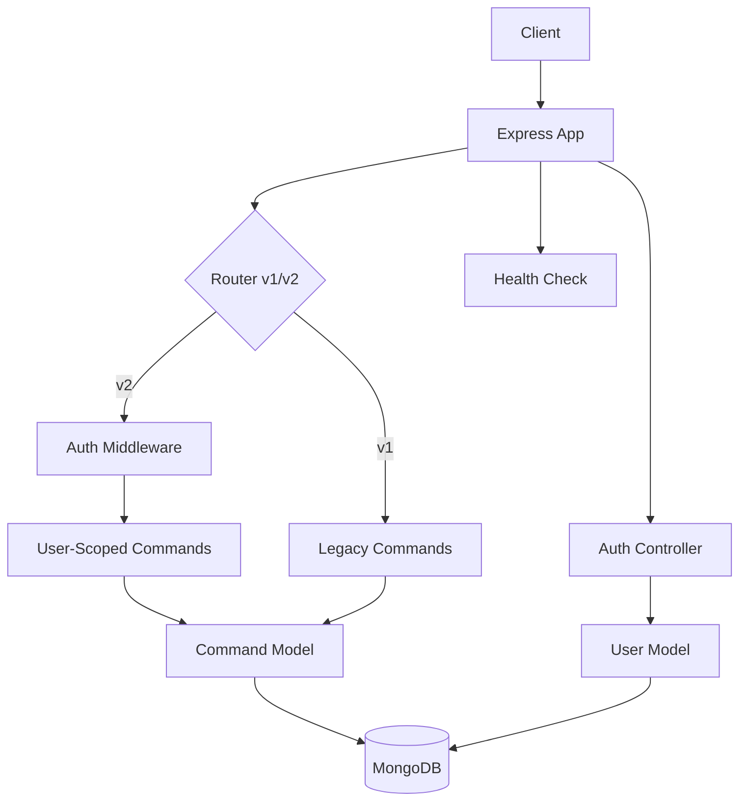

# Commander Architecture

Commander Backend is a modular Express API that maps slash-style commands such as `/hello` to predefined text responses.

Starting with v2, the system introduces **User Authentication** and **Data Ownership**, allowing multiple users to manage their own private command snippets.

## System Diagram



## Runtime Modes

The application primarily runs in **MongoDB mode** for production and v2 features.

| Mode    | Entry Point            | Storage                    | Notes                                        |
| ------- | ---------------------- | -------------------------- | -------------------------------------------- |
| MongoDB | `src/mongo-db.js`      | MongoDB via Mongoose       | Supports v1, v2, and User Authentication.    |
| Local\* | `src/app.js` (factory) | `src/config/commands.json` | \*Legacy support via CommandModel injection. |

## Project Structure

```text
.
├── ARCHITECTURE.md
├── README.md
├── backend/
│   ├── api.http
│   ├── package.json
│   └── src/
│       ├── app.js              # App factory & shared middleware
│       ├── mongo-db.js         # MongoDB-backed server entry point
│       ├── config/
│       │   ├── config.js       # Environment configuration & SMTP validation
│       │   ├── constants.js    # System-wide constants (tokens, cookies)
│       │   └── swagger.js      # OpenAPI/Swagger configuration
│       ├── controllers/
│       │   ├── authController.js     # User registration, login, refresh, logout
│       │   ├── commandsController.js # CRUD for commands
│       │   └── healthController.js   # Service health check
│       ├── middleware/
│       │   ├── authMiddleware.js     # JWT verification
│       │   ├── authValidation.js     # Input validation for auth routes
│       │   ├── csrfMiddleware.js     # CSRF protection (Double-Submit pattern)
│       │   ├── loggerMiddleware.js   # Request logging
│       │   └── triggerMiddleware.js  # Legacy trigger resolution
│       ├── models/
│       │   ├── local-system/
│       │   │   └── commandModel.js   # JSON-backed command model
│       │   └── mongo/
│       │       ├── commandModel.js   # Mongoose-backed command model
│       │       ├── refreshTokenModel.js # Mongoose-backed refresh token model
│       │       └── userModel.js      # Mongoose-backed user model
│       ├── router/
│       │   └── router.js             # Version-aware route definitions
│       ├── schemas/
│       │   └── mongo-schema/
│       │       ├── commandSchema.js  # Mongoose schema for commands
│       │       ├── refreshTokenSchema.js # Mongoose schema for refresh tokens
│       │       └── userSchema.js     # Mongoose schema for users
│       ├── utils/
│       │   ├── auth.js               # JWT and Password utilities
│       │   ├── cookies.js            # Cookie setters/clearers for RT and CSRF
│       │   ├── email.js              # Nodemailer/SMTP transport
│       │   └── errors.js             # Custom Error classes & handler
│       └── web/
│           ├── index.html            # Prototype frontend
│           ├── index.js
│           └── style/
│               └── style.css
```

## Key Paths

| Path                                       | Role                                                                                                                                                                                             |
| ------------------------------------------ | ------------------------------------------------------------------------------------------------------------------------------------------------------------------------------------------------ |
| `backend/src/app.js`                       | Main Express factory. Configures CORS (with explicit allowed headers and origin), logging, and routing. Registers cookie-parser middleware.                                                      |
| `backend/src/router/router.js`             | Mounts v1 (public) and v2 (authenticated) API paths. Conditionally mounts Google OAuth routes if environment variables are set. Bifurcated auth endpoints: `/refresh`, `/logout`, `/logout-all`. |
| `backend/src/utils/googleOAuth.js`         | Google OAuth2 utility functions (client, state, profile exchange).                                                                                                                               |
| `backend/src/utils/email.js`               | Manages SMTP transporter for password reset emails.                                                                                                                                              |
| `backend/src/utils/auth.js`                | Core logic for JWT signing, password hashing, and bifurcated token creation (Access Token, Refresh Token).                                                                                       |
| `backend/src/utils/cookies.js`             | Utilities for setting and clearing RT and CSRF cookies with secure flags (httpOnly, Secure, SameSite).                                                                                           |
| `backend/src/middleware/csrfMiddleware.js` | CSRF protection using HMAC-signed Double-Submit Cookie pattern. Validates `x-csrf-token` header against `__csrf` cookie.                                                                         |

## API Summary

The API is versioned. v1 is maintained for backward compatibility, while v2 requires authentication.

### Health Check

- `GET /api/health` - Check service status.

### Authentication (v2)

| Method | Route                                | Purpose                                                                |
| ------ | ------------------------------------ | ---------------------------------------------------------------------- |
| `POST` | `/api/v2/auth/register`              | Register a new user account (issues AT + RT).                          |
| `POST` | `/api/v2/auth/login`                 | Authenticate and receive Access Token + Refresh Token cookie.          |
| `POST` | `/api/v2/auth/refresh`               | Refresh Access Token using Refresh Token cookie. Requires CSRF header. |
| `POST` | `/api/v2/auth/logout`                | Logout from current device. Clears RT cookie.                          |
| `POST` | `/api/v2/auth/logout-all`            | Logout from all devices. Revokes all RT families.                      |
| `GET`  | `/api/v2/auth/google`                | Initiate Google OAuth sign-in (if enabled).                            |
| `GET`  | `/api/v2/auth/google/callback`       | Google OAuth callback (if enabled).                                    |
| `POST` | `/api/v2/auth/forgot-password`       | Request a password reset link via email.                               |
| `POST` | `/api/v2/auth/reset-password/:token` | Reset password using a valid token (URL param).                        |
| `POST` | `/api/v2/auth/password-resets`       | Reset password using a token in the request body.                      |

### Commands

| Method   | v1 Route (Public)   | v2 Route (Auth Required)  | Purpose                                              |
| -------- | ------------------- | ------------------------- | ---------------------------------------------------- |
| `GET`    | `/api/commands`     | `/api/v2/commands`        | List owned commands.                                 |
| `GET`    | `/api/commands/:id` | `/api/v2/commands/:id`    | Get command by ID.                                   |
| `GET`    | -                   | `/api/v2/commands/search` | Search templates by command or keyword with ranking. |
| `POST`   | `/api/commands`     | `/api/v2/commands`        | Create a command.                                    |
| `PATCH`  | `/api/commands/:id` | `/api/v2/commands/:id`    | Update a command.                                    |
| `DELETE` | `/api/commands/:id` | `/api/v2/commands/:id`    | Delete a command.                                    |

## Configuration

The application is configured via environment variables:

| Variable               | Description                                                       | Default |
| ---------------------- | ----------------------------------------------------------------- | ------- |
| `PORT`                 | Port number for the Express server.                               | 1234    |
| `DATABASE_URL`         | MongoDB connection string.                                        | -       |
| `API_VERSION`          | `v1`, `v2`, or `both`. Controls route mounting.                   | `both`  |
| `JWT_SECRET`           | Secret key for legacy JWT verification (v1 migration).            | -       |
| `AT_SECRET`            | HMAC secret for signing short-lived Access Tokens (15-min).       | -       |
| `RT_BYTE_LENGTH`       | Byte length for opaque Refresh Token generation.                  | `48`    |
| `CSRF_SECRET`          | HMAC secret for CSRF token signing (must differ from AT_SECRET).  | -       |
| `NODE_ENV`             | Environment (`production` enables `Secure` cookie flag).          | -       |
| `COOKIE_DOMAIN`        | Domain for cookie scoping in production (e.g., `.commander.app`). | -       |
| `GOOGLE_CLIENT_ID`     | OAuth 2.0 Client ID from Google Cloud Console (optional).         | -       |
| `GOOGLE_CLIENT_SECRET` | OAuth 2.0 Client Secret from Google Cloud Console (optional).     | -       |
| `GOOGLE_CALLBACK_URL`  | Full callback URL registered in Google Console (optional).        | -       |
| `SMTP_HOST`            | SMTP server for sending reset emails.                             | -       |
| `SMTP_PORT`            | SMTP port (e.g., 587 or 465).                                     | -       |
| `SMTP_USER`            | SMTP authentication username.                                     | -       |
| `SMTP_PASS`            | SMTP authentication password.                                     | -       |
| `EMAIL_FROM`           | Email sender address.                                             | -       |
| `FRONTEND_URL`         | Base URL for password reset links and CORS origin.                | -       |

### Bifurcated Authentication Configuration

The bifurcated auth system requires three additional environment variables for security:

- **`AT_SECRET`**: Used to sign Access Tokens. Should be a 64-character hex string.
- **`CSRF_SECRET`**: Used to sign CSRF tokens via HMAC. Must be different from `AT_SECRET`.
- **`RT_BYTE_LENGTH`**: Controls opaque Refresh Token length (default 48 bytes). Increase for higher security.

Both secrets should be generated using a cryptographically secure random generator:

```bash
node -e "console.log(require('crypto').randomBytes(32).toString('hex'))"
```

## Security Notes

- **Password Hashing**: Done via `bcrypt` with `SALT_ROUNDS=10`.
- **Bifurcated Authentication**:
  - **Access Tokens (AT)**: Short-lived (15-min) JWTs signed with `AT_SECRET`. Stored only in volatile application memory on the client.
  - **Refresh Tokens (RT)**: Long-lived (7-day) opaque strings delivered via `Set-Cookie` with `httpOnly: true`, `Secure: true`, and `SameSite: Strict`.
  - **Refresh Token Rotation**: Every successful `/refresh` issues a new RT; the old RT is invalidated to prevent token theft.
  - **Theft Detection**: RTs are organized into families. Reuse of a consumed RT revokes the entire family.
  - **Silent Refresh**: Expired ATs trigger automatic refresh via `/refresh` endpoint without user intervention.
- **CSRF Protection**: Stateless HMAC-signed Double-Submit Cookie pattern on `/refresh` endpoint. Frontend reads non-httpOnly `__csrf` cookie and sends it as `x-csrf-token` header.
- **Ownership**: Every command in v2 is linked to a `userId`. The system prevents users from accessing or modifying commands they do not own.
- **Email Security**: SMTP configuration is validated at startup to ensure the "Forgot Password" service is reliable.
- **Google OAuth**: If Google OAuth environment variables are set, users can sign in or link accounts via Google. The system supports mixed local/Google authentication and gracefully degrades if not configured.
- **CORS**: CORS is enabled with credentials and requires an explicit `FRONTEND_URL` origin. The `x-csrf-token` header is allowed for CSRF protection.

## Token Lifecycle

The bifurcated authentication system ensures secure, stateless session management:

1. **Login/Register**: System issues Access Token (AT) in response body and Refresh Token (RT) in httpOnly cookie. Both are stored in a MongoDB `refresh_tokens` collection with a `familyId` for tracking.

2. **API Requests**: Frontend injects AT from volatile memory as `Authorization: Bearer <AT>` header. RT cookie is automatically attached by the browser.

3. **AT Expiry**: When AT expires (401 response), frontend silently calls `POST /api/v2/auth/refresh` with CSRF header. Server validates RT, creates new AT, rotates RT (old RT marked as consumed), and returns new AT in response body.

4. **Concurrent Requests**: If multiple requests fail with 401 simultaneously, only one `/refresh` is dispatched via a mutex. All pending requests queue and retry once new AT is available.

5. **Token Theft Detection**: If a consumed RT is presented to `/refresh`, the system interprets this as theft, revokes the entire RT family (all RTs linked by `familyId`), and returns 401.

6. **Logout (Single Device)**: `/logout` endpoint clears RT cookie and deletes the specific RT record from MongoDB.

7. **Logout All (Global Revocation)**: `/logout-all` endpoint deletes all RT families for the authenticated user across all devices.

8. **TTL Cleanup**: MongoDB automatically removes expired RT records via TTL index on `expiresAt` field.
